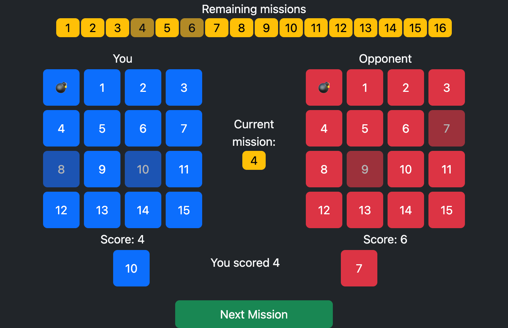

# Spymaster

J. M. F. Tsang (j.m.f.tsang@cantab.net)

---

This is a remake of Richard Bartle's game 
[Spymaster](https://www.youhaventlived.com/spymaster/), rewritten with a
Python backend. 

Spymaster is based on [Goofspiel](https://en.wikipedia.org/wiki/Goofspiel),
a classic game of bluffing and double-bluffing.

It's my attempt at writing a multiplayer browser game. 


## Usage



```bash
# Start a webserver
python -m spymaster.webserver
# then go to http://localhost:8000
```
```bash
# Play against a computer player
python -m spymaster Russia
```
```bash
# Play two AIs against each other
python -m spymaster Russia America
```
